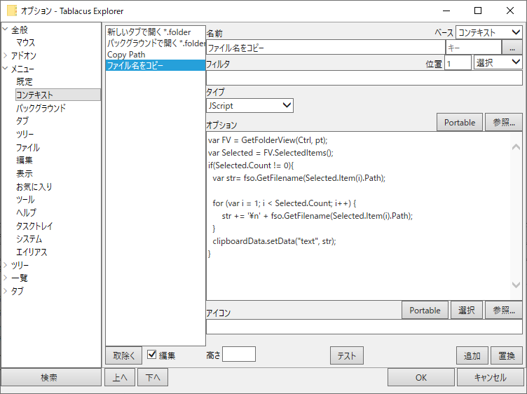

# Description
A JS script to copy selected file name into clipboard in [tablacus explorer](https://tablacus.github.io/explorer.html)

# How to install
Please configure tablacus as the below image.

**Setting:**  
  
  
**Script:**  
```js
var FV = GetFolderView(Ctrl, pt);
var Selected = FV.SelectedItems();
if(Selected.Count != 0){
  var str= fso.GetFilename(Selected.Item(i).Path);

  for (var i = 1; i < Selected.Count; i++) {
      str += '\n' + fso.GetFilename(Selected.Item(i).Path);
  }
  clipboardData.setData("text", str);
}
```

# Env
TE64 21.3.7 Windows 10 Pro 2004 (10.0.19041) IE/11 JS/11.0.16384 ja_jp 96 Windows Defender
